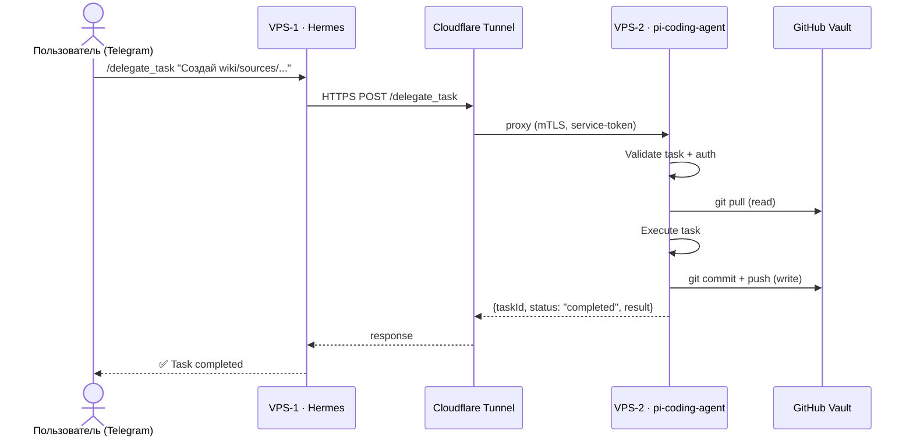

# Протокол: delegate_task — Sequence Diagram

> **Обновлено:** 2026-09-26  
> **Тип:** Sequence diagram (mermaid)  
> **Статус:** Рабочий чертёж

## Описание

Последовательность вызовов при делегировании задачи от Hermes (VPS-1) к pi-coding-agent (VPS-2) через Cloudflare Tunnel.



## Методы протокола

| Метод | Что делает | Когда | Ответ |
| --- | --- | --- | --- |
| `delegate_task` | Запустить подзадачу в pi | Любая RACI-задача | `{taskId, status: "running"}` |
| `delegate_status` | Проверить статус | Через 30 сек после delegate | `{taskId, status: "completed"}` |
| `delegate_stop` | Прервать по taskId | Ошибка / таймаут | `{taskId, status: "stopped"}` |
| `delegate_steer` | Передать steering | Нужна коррекция курса | `{taskId, status: "steering"}` |
| `read_file` | Прочитать файл vault | Для контекста в Hermes | `{content, path}` |
| `git_log` | Последние N коммитов | Для отчёта в Telegram | `{commits: [...]}` |

## JSON-RPC формат запроса

```json
// REQUEST
{
  "jsonrpc": "2.0",
  "id": "task-2026-09-25-001",
  "method": "delegate_task",
  "params": {
    "task": "Прочитай raw/online/2026-09-25-openrouter-pricing.md",
    "context": {
      "vault_path": "/opt/vault",
      "template": "wiki/concepts/llm-wiki-template.md",
      "model": "anthropic/claude-fable-5.1",
      "thinking": "high",
      "max_tokens": 8192
    },
    "tools_allowed": ["read_file", "write_file", "git_commit"],
    "timeout_ms": 300000
  }
}

// RESPONSE
{
  "jsonrpc": "2.0",
  "id": "task-2026-09-25-001",
  "result": {
    "taskId": "task-2026-09-25-001",
    "status": "running",
    "started_at": "2026-09-25T10:23:01Z",
    "estimated_completion": "2026-09-25T10:25:30Z"
  }
}
```

## Безопасность

- Аутентификация: `Authorization: Bearer ${PI_AGENT_TOKEN}`
- TLS: Cloudflare Tunnel (mTLS между VPS)
- Доступ: только service-token от VPS-1
- Порт 8080 VPS-2: **не открыт в интернет**
