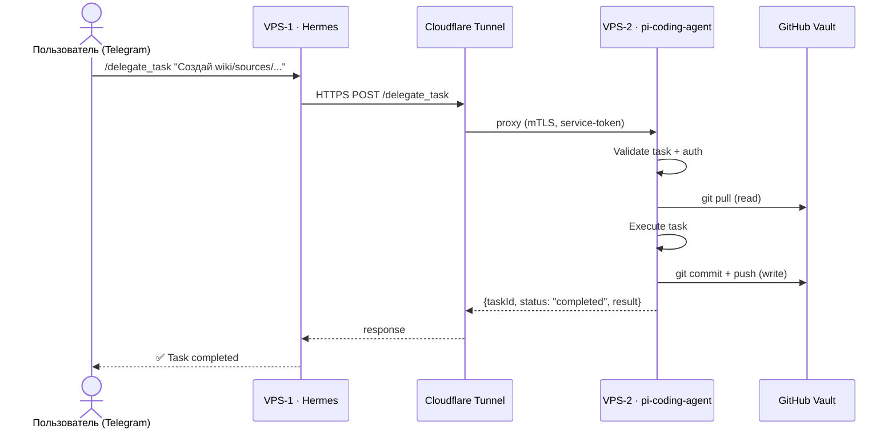
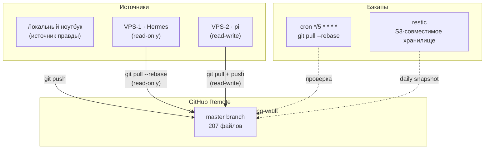

# Архитектура: Блочная схема

> **Обновлено:** 2026-09-26  
> **Тип:** Block diagram (mermaid)  
> **Статус:** Рабочий чертёж всей задумки

## Описание

Блочная схема отражает полную архитектуру проекта: **локальный ноутбук + прод-стек (2 VPS) + test-инфраструктура (3 VPS) + сетевые мосты**. Зелёным выделено что уже реализовано, серым — что запланировано.

## Блок-схема: Полная архитектура

```mermaid
flowchart TB
    subgraph LOCAL["💻 ЛОКАЛЬНЫЙ НОУТБУК (Windows)"]
        OBSIDIAN["Obsidian Vault\nC:\Users\AlexSota\Documents\Bases\Вайбкодинг"]
        PI_SETTINGS["pi ~/.pi/agent/\nsettings.json\nmodels.json"]
        SSH_KEYS["SSH Keys\n~/.ssh/test-{1,2,3}\ned25519"]
        GIT["git\nvault repo\n(2 коммита)"]
    end

    subgraph GITHUB["☁️ GITHUB (suetovalx-glitch/vaybcoding-vault)"]
        GH_REPO["vaybcoding-vault\n207 файлов\n2 коммита"]
        GH_SECRET["⚠️ Секреты исключены\n.pi/agent/*\nVPS/test-1.md\nVPS/test-2.md\nVPS/pi-agent.md"]
    end

    subgraph PROD["🚀 ПРОД-СТЕК (2 VPS)"]
        subgraph VPS1["VPS-1 · Hermes (оркестратор)"]
            H["Hermes Agent v0.21\nDocker\ncloudflared"]
            H_TELEGRAM["Telegram Bot"]
            H_DISCORD["Discord Bot"]
            H_CRON["Cron Jobs"]
        end

        subgraph VPS2["VPS-2 · pi-coding-agent (исполнитель)"]
            P["pi-coding-agent\nnpm systemd\ncloudflared"]
            P_LENS["pi-lens\npi-subagents\npi-mcp-adapter"]
            P_MCP["MCP Server\nchrome-devtools\nfilesystem\ngithub\ncontext7"]
            P_OBS["MCP: obsidian\n(read-write)"]
        end
    end

    subgraph TEST["🧪 TEST-ИНФРАСТРУКТУРА (3 VPS)"]
        subgraph T1["VPS-test-1 · Stage-pi"]
            T1_PI["pi-coding-agent (staging)\nAdminVPS\nФинляндия\nIP: 78.17.67.159"]
        end

        subgraph T2["VPS-test-2 · Stage-Hermes"]
            T2_H["Hermes Agent (staging)\nhshp.host DE-E2\nID: 1950834\nIP: 31.77.192.54"]
        end

        subgraph T3["VPS-test-3 · Stage-Infra"]
            T3_DOCK["docker-compose стенды\nNode-RED + Mosquitto +\nTraefik + Ollama + Benchmarks\n⚠️ IP/логин не получены"]
        end
    end

    subgraph NET["🌐 СЕТЕВЫЕ МОСТЫ"]
        CFT1["Cloudflare Tunnel\nhermes-tg\hermes-dc"]
        CFT2["Cloudflare Tunnel\npi.internal.example.com\n(приватный)"]
        NB["NetBird (опционально)\nmesh-VPN WireGuard\n100.64/12"]
    end

    subgraph LLM["🤖 LLM-ПРОВАЙДЕРЫ"]
        OR["OpenRouter\n(gpt-6-luna, claude-fable-5.1,\n glm-5.3-flash, mimo-v2.6-pro)"]
        WORM["Wormsoft AI\n(minimax-m3, onlycode,\n vision, extra)"]
        OLLAMA["Ollama (test-3)\nself-hosted CPU"]
    end

    %% CONNECTIONS
    LOCAL -.->|"git push/pull"| GITHUB
    LOCAL -.->|"SSH"| TEST
    LOCAL -.->|"SSH"| PROD
    VPS1 <-->|"Cloudflare Tunnel\n(delegated_task)"| VPS2
    VPS1 <-->|HTTPS| OR
    VPS2 <-->|HTTPS| OR
    VPS1 <-->|HTTPS| WORM
    T1 <-->|docker-compose"| OR
    T2 <-->|docker-compose"| WORM
    T3 <-->|Ollama"| OLLAMA
    VPS1 -->|Cloudflare Tunnel| CFT1
    VPS2 -->|Cloudflare Tunnel| CFT2
    CFT2 -.->|mTLS| CFT1
    NB -.->|mesh VPN| VPS1
    NB -.->|mesh VPN| VPS2
    NB -.->|mesh VPN| T1
    NB -.->|mesh VPN| T2
    NB -.->|mesh VPN| T3

    %% STYLE
    classDef done fill:#d4edda,stroke:#28a745,stroke-width:2px;
    classDef planned fill:#fff3cd,stroke:#ffc107,stroke-width:2px;
    classDef infra fill:#e2e3e5,stroke:#6c757d,stroke-width:1px;
    class OBSIDIAN,PI_SETTINGS,GIT,GH_REPO,H,P,T1_PI,T2_H done;
    class T3_DOCK,CFT1,CFT2,NB,OR,WORM,OLLAMA,SSH_KEYS planned;
    class LOCAL,GITHUB,TEST,PROD,NET,LLM infra;
```

## Блок-схема: Протокол delegate_task



## Блок-схема: Деплой test-infra (пока не запущен)

```mermaid
flowchart LR
    subgraph PREP["Подготовка"]
        A["Получить IP test-3"] --> B["Заполнить VPS/test-3.md frontmatter"]
        B --> C["Подключиться по SSH\nssh -i ~/.ssh/test-3-ed25519 root@<ip>"]
    end

    subgraph HARDEN["Hardening"]
        C --> D["useradd -m infra"]
        D --> E["SSH key + disable password"]
        E --> F["ufw + fail2ban"]
        F --> G["Docker + compose"]
    end

    subgraph DEPLOY["Деплой"]
        G --> H["mkdir /opt/infra-test"]
        H --> I["docker-compose.yml\nnode-red + mosquitto +\ntraefik + ollama + benchmarks"]
        I --> J["docker compose up -d"]
    end

    subgraph TEST["Smoke-test"]
        J --> K["Ollama: ollama run qwen3.6:27b"]
        K --> L["Mosquitto: mosquitto_sub -t 'test/+']"]
        L --> M["Node-RED: http://localhost:1880"]
        M --> N["Traefik: http://localhost:8080"]
    end

    PREP --> HARDEN --> DEPLOY --> TEST
```



## Блок-схема: Git-синхронизация



## Легенда

| Цвет | Значение |
| --- | --- |
| 🟢 Зелёный фон | Реализовано ✅ |
| 🟡 Жёлтый фон | Планируется / в работе ⏳ |
| ⚪ Серый фон | Инфраструктура / контекст |
| 🔴 Красный | Блокер / не выполнено ❌ |

## Статус компонентов

### ✅ Реализовано (2026-09-26)
- [x] GitHub репо `vaybcoding-vault` (2 коммита, 207 файлов)
- [x] `.gitignore` с исключением секретов
- [x] SSH-ключи test-1, test-2, test-3 (ed25519)
- [x] Локальный vault в Git
- [x] Конфиги pi (`settings.json`, `models.json`)
- [x] `VPS/test-3.md` с SSH-ключами
- [x] Навигация `Сессии/index.md` обновлена
- [x] Сессия `Сессии/2026-09-26/диалог-01` сохранена

### ⏳ Запланировано (ждут доступ)
- [ ] test-3 VPS: IP/логин/пароль
- [ ] test-infra деплой на test-3
- [ ] test-1, test-2 деплой (доступ есть, но не запущен)
- [ ] VPS-1 (Hermes) деплой
- [ ] VPS-2 (pi-coding-agent) деплой
- [ ] Cloudflare Tunnel настройка
- [ ] NetBird mesh-VPN
- [ ] API-ключ Wormsoft

### ❌ Блокеры
- [ ] test-3 VPS: IP/логин/пароль не получены
- [ ] VPS-1 (AdminVPS): IP/логин/порт не присланы
- [ ] API-ключ Wormsoft не получен
