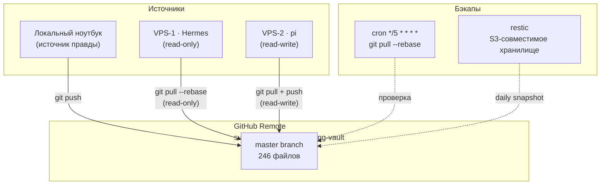

# Git-синхронизация: Схема

> **Обновлено:** 2026-09-26  
> **Тип:** Flowchart (mermaid)  
> **Статус:** Реализовано

## Описание

Схема git-синхронизации между локальным ноутбуком, GitHub remote и VPS-1/VPS-2.

## Правила sync

| Участник | Действие | Направление | Частота |
| --- | --- | --- | --- |
| Локальный ноутбук | `git push` | LOC → GitHub | При каждом изменении |
| VPS-1 (Hermes) | `git pull --rebase` | GitHub → VPS-1 | Каждые 5 мин (cron) |
| VPS-2 (pi) | `git pull + push` | ↔ GitHub | При каждом изменении |
| restic | snapshot | Vault → S3 | Ежедневно |

## Правила записи

- **Локальный ноутбук** — единственный источник правды для `wiki/`
- **VPS-1 (Hermes)** — только `git pull` (read-only), никогда не делает push
- **VPS-2 (pi)** — `git push` разрешён (read-write), единственный writer в `wiki/`
- **Конфликты** — разрешаются через `last-writer-wins` + ручной ревью раз в неделю

## Статус

- [x] GitHub remote настроен: `suetovalx-glitch/vaybcoding-vault`
- [x] 246 файлов закоммичены
- [x] `.gitignore` с исключением секретов
- [ ] Cron-синхронизация на VPS-1/VPS-2 (ждут деплоя)
- [ ] restic бэкап (ждёт деплоя)
