# Тестовая инфраструктура: Deployment Flow

> **Обновлено:** 2026-09-26  
> **Тип:** Flowchart (mermaid)  
> **Статус:** Ждёт доступа к test-3 VPS

## Описание

Пошаговый flow деплоя test-infrastructure на VPS-test-3 (Stage-Infra). Пока не запущен — блокер: IP/логин/пароль не получены.

```mermaid
flowchart LR
    subgraph PREP["Подготовка"]
        A["Получить IP test-3"] --> B["Заполнить VPS/test-3.md frontmatter"]
        B --> C["Подключиться по SSH\nssh -i ~/.ssh/test-3-ed25519 root@<ip>"]
    end

    subgraph HARDEN["Hardening"]
        C --> D["useradd -m infra"]
        D --> E["SSH key + disable password"]
        E --> F["ufw + fail2ban"]
        F --> G["Docker + compose"]
    end

    subgraph DEPLOY["Деплой"]
        G --> H["mkdir /opt/infra-test"]
        H --> I["docker-compose.yml\nnode-red + mosquitto +\ntraefik + ollama + benchmarks"]
        I --> J["docker compose up -d"]
    end

    subgraph TEST["Smoke-test"]
        J --> K["Ollama: ollama run qwen3.6:27b"]
        K --> L["Mosquitto: mosquitto_sub -t 'test/+']"]
        L --> M["Node-RED: http://localhost:1880"]
        M --> N["Traefik: http://localhost:8080"]
    end

    PREP --> HARDEN --> DEPLOY --> TEST
```

## Статус компонентов

| Компонент | Статус | Примечание |
| --- | --- | --- |
| test-3 IP | ❌ Блокер | Не прислан пользователем |
| SSH подключение | ⏳ Готово | Ключ есть `~/.ssh/test-3-ed25519` |
| Docker | ⏳ На VPS-3 не установлен | После подключения |
| Node-RED | ⏳ На VPS-3 не настроен | Через compose |
| Mosquitto | ⏳ На VPS-3 не настроен | Через compose |
| Traefik | ⏳ На VPS-3 не настроен | Через compose |
| Ollama | ⏳ На VPS-3 не настроен | self-hosted CPU |

## Теги для тест-3

- `#role/test` `#stack/docker` `#role/infra` `#stack/dual-agent-test`
- Провайдер: hshp.host MSK-1 (рекомендация из `wiki/concepts/docker-test-stack.md`)
- Цена: ~400–600 ₽/мес
- Ресурсы: 2 vCPU / 4 ГБ / 60 ГБ
