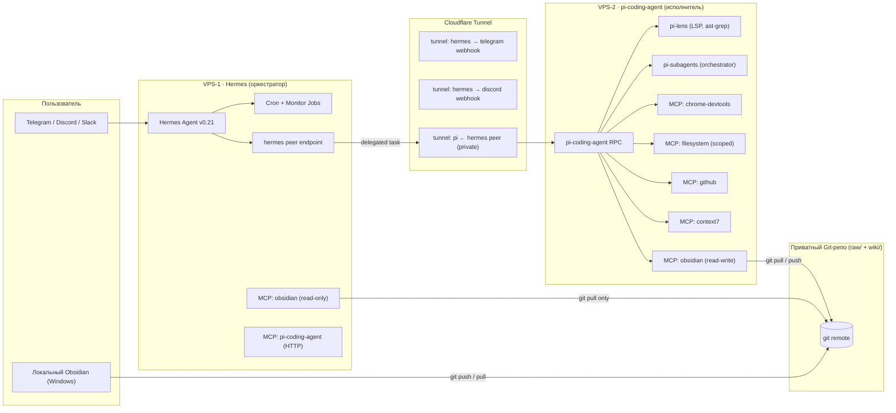

# Dual-Agent Stack: Hermes + pi-coding-agent на двух VPS

## Source Metadata

- **Дата:** 2026-09-25.
- **Тип:** synthesis/concept (концепт развёртывания).
- **Сырьё:**
  - [[wiki/entities/hermes-agent]] — Hermes Agent v0.21 (Pantheon Release).
  - [[wiki/entities/pi-agent]] — pi-coding-agent / pi-subagents / pi-mcp-adapter.
  - [[wiki/entities/amvera-cloud]] — платформа деплоя.
  - [[wiki/entities/cloudflare-tunnel]] — безопасный сетевой мост.
  - [[wiki/entities/openrouter]] — общий LLM-провайдер.
  - [[wiki/concepts/mcp-basics]] — протокол между агентами.
  - [[wiki/concepts/agent-memory-skills]] — память и навыки.
  - [[wiki/sources/2026-09-18-ai-vps-control]] — кейс развёртывания AI-агента на VPS.
  - [[wiki/comparisons/2026-09-25-model-shortlist]] — выбор моделей.
  - `VPS/AdminVPS.md` — шаблон описания VPS.
  - `VPS/ssh-command.md` — Templater для SSH-команд.
- **Аналитик:** pi-coding-agent (роль: архитектор стека).

## Summary

Hermes и pi-coding-agent работают на **двух отдельных VPS** с разделением ролей «оркестратор ↔ исполнитель». Hermes — публичный фасад (Telegram, Discord, cron), pi-coding-agent — приватный исполнитель кода, MCP-tools (Chrome DevTools, filesystem, GitHub) и curator Obsidian-базы. Связь — через **Cloudflare Tunnel** + **`hermes peer` over MCP**, без прямого暴露а второго VPS в интернет. Источник правды — Obsidian vault на локальной машине; оба VPS синхронизируются через git.

## Тезисы (Top-Level Decisions)

1. **VPS-1 — Hermes** (оркестратор, публичный).
2. **VPS-2 — pi-coding-agent** (исполнитель, приватный).
3. **Связь только через Cloudflare Tunnel** — никаких открытых портов между VPS и наружу, кроме публичных webhooks.
4. **Source of truth — локальный Obsidian vault** (Windows, `C:\Users\AlexSota\Documents\Bases\Вайбкодинг`). Оба VPS — копии через `git pull` из приватного репозитория.
5. **Общий LLM-провайдер — openrouter** (через `OPENROUTER_API_KEY`), плюс локальные бесплатные (wormsoft / xiaomi) для рутины.
6. **Hermes не пишет в `wiki/` напрямую** — только кладёт сырьё в `raw/` и дёргает pi-coding-agent через MCP. **pi-coding-agent — единственный writer в `wiki/sources/`, `wiki/concepts/`, `wiki/entities/`**.
7. **Память двухслойная:** Hermes `MEMORY.md` / `USER.md` ↔ наш `Сессии/YYYY-MM-DD/USER.md` через git sync.

## Архитектура



### Network topology (кто куда смотрит)

| Откуда | Куда | Протокол | Через |
| --- | --- | --- | --- |
| Telegram API → Hermes | ingress | HTTPS | Cloudflare Tunnel `hermes-tg` |
| Discord API → Hermes | ingress | HTTPS | Cloudflare Tunnel `hermes-dc` |
| Hermes → pi-coding-agent | egress | HTTPS (mTLS) | Cloudflare Tunnel `pi-private` |
| pi-coding-agent → Git remote | egress | SSH/HTTPS | прямое (whitelist IP) |
| Hermes → Git remote | egress | SSH/HTTPS | прямое |
| Оба VPS → OpenRouter | egress | HTTPS | прямое |
| Obsidian (локально) → Git remote | egress | SSH | прямое |

**Открытых портов между VPS и внешним миром — 0.** Только Cloudflare-edge.

## Разделение ролей (RACI)

| Задача | Hermes | pi-coding-agent | Локальный Obsidian |
| --- | --- | --- | --- |
| Принимать сообщения из Telegram/Discord | **R** | — | — |
| Cron / scheduled jobs | **R** | — | — |
| Краткая summarisation / классификация | **R** (mimo-v2.6-flash) | — | — |
| Открывать браузер, кликать, скриншотить | — | **R** (chrome-devtools) | — |
| Делать git-коммиты в `wiki/` | — | **R** | approve |
| Рефакторинг кода, multi-file edit | — | **R** (с pi-lens) | approve |
| Парсить новые источники в `raw/online/` | **R** | — | approve |
| Строить source-summary, обновлять `wiki/sources/` | — | **R** | approve |
| Long-running браузерные сценарии | — | **R** | approve |
| Финальный lint / ревью wiki | — | **R** | approve |
| Читать vault (например, для контекста) | **R** (через MCP obsidian) | **R** | — |
| Писать в vault (создавать страницы) | — | **R** | approve |
| Хранить «факты о пользователе» | **R** (`MEMORY.md`/`USER.md`) | mirror (`Сессии/USER.md`) | **source of truth** |

**Правило:** если задача требует **записи в vault** → только pi-coding-agent. Если только **чтение** → оба.

## Технические характеристики VPS

### VPS-1 · Hermes (оркестратор)

| Параметр | Минимум | Рекомендация |
| --- | --- | --- |
| CPU | 1 vCPU | 2 vCPU |
| RAM | 1 ГБ | 2 ГБ |
| Disk | 20 ГБ SSD | 40 ГБ SSD |
| OS | Ubuntu 24.04 LTS | Ubuntu 24.04 LTS |
| Сеть | 100 Мбит | 1 Гбит |
| Регион | Москва (Amvera) или ближайший к юзеру | — |
| Стоимость | ~170 ₽/мес (Amvera Micro) | ~500 ₽/мес |

Софт: `nousresearch/hermes-agent:latest` (Docker), `cloudflared`, `git`, `cron`.

### VPS-2 · pi-coding-agent (исполнитель)

| Параметр | Минимум | Рекомендация |
| --- | --- | --- |
| CPU | 2 vCPU | 4 vCPU |
| RAM | 4 ГБ | 8 ГБ (Chromium жрёт) |
| Disk | 40 ГБ SSD | 80 ГБ SSD |
| OS | Ubuntu 24.04 LTS | Ubuntu 24.04 LTS |
| Сеть | 100 Мбит | 1 Гбит |
| Регион | Тот же, что и VPS-1 | — |
| Стоимость | ~600 ₽/мес | ~1500 ₽/мес |

Софт: Node 22 LTS, `pi-coding-agent` (npm global), `pi-mcp-adapter`, `pi-subagents`, `pi-lens`, `pi-web-access`, `chromium` (для `chrome-devtools`), `cloudflared`, `git`, `restic` (бэкапы).

### Storage / Backup

- **Vault** синхронизируется через git (приватный репозиторий, например `git@github.com:user/obsidian-vault-private.git`).
- **Hermes data** (`MEMORY.md`, `USER.md`, `~/.hermes/`) бэкапится отдельным git-репо каждый час через cron.
- **pi-coding-agent runtime** (`~/.pi/agent/sessions/`) — ежедневный restic-снапшот в S3-совместимое хранилище (или на тот же VPS-1 через rsync).

## Конфигурация

### VPS-1: `docker-compose.yml` для Hermes

```yaml
# /opt/hermes/docker-compose.yml
services:
  hermes:
    image: nousresearch/hermes-agent:latest
    container_name: hermes
    restart: unless-stopped
    volumes:
      - /opt/data/hermes:/root/.hermes           # MEMORY.md, USER.md, skills, sessions
      - /opt/data/vault:/opt/vault:ro            # vault read-only
    environment:
      TELEGRAM_BOT_TOKEN: ${TELEGRAM_BOT_TOKEN}
      TELEGRAM_ALLOWED_USERS: ${TELEGRAM_ALLOWED_USERS}
      OPENROUTER_API_KEY: ${OPENROUTER_API_KEY}
      # pi-coding-agent endpoint (через Cloudflare Tunnel)
      PI_AGENT_URL: https://pi.internal.example.com
      PI_AGENT_TOKEN: ${PI_AGENT_TOKEN}
      # Vault sync
      VAULT_REPO: git@github.com:user/obsidian-vault-private.git
      VAULT_PATH: /opt/vault
    command: >
      sh -c "cd /opt/vault && git pull --rebase &&
             hermes gateway start --channels telegram,discord --port 8080"
```

### VPS-2: запуск pi-coding-agent как systemd-сервис

```ini
# /etc/systemd/system/pi-agent.service
[Unit]
Description=pi-coding-agent (RPC + MCP server)
After=network.target

[Service]
Type=simple
User=pi
Environment=NODE_ENV=production
Environment=PI_AGENT_PORT=8080
Environment=PI_AGENT_TOKEN_FILE=/etc/pi/agent.token
Environment=VAULT_PATH=/opt/vault
Environment=OPENROUTER_API_KEY_FILE=/etc/pi/openrouter.key
ExecStart=/usr/bin/node /usr/lib/node_modules/pi-coding-agent/dist/rpc.js
Restart=always
RestartSec=5
# Hardening
NoNewPrivileges=true
ProtectSystem=strict
ProtectHome=true
ReadWritePaths=/opt/vault /opt/pi/sessions /tmp

[Install]
WantedBy=multi-user.target
```

### Cloudflare Tunnel

```yaml
# ~/.cloudflared/config.yml (один конфиг, запускается на ОБОИХ VPS)
tunnel: hermes-pi-stack
credentials-file: /etc/cloudflared/<tunnel-id>.json

ingress:
  # VPS-1 публичные
  - hostname: hermes-tg.internal.example.com
    service: http://localhost:8080
  - hostname: hermes-dc.internal.example.com
    service: http://localhost:8081
  # VPS-2 приватный — НЕ публикуем в DNS, только route между туннелями
  - hostname: pi.internal.example.com
    service: http://localhost:8080
  - service: http_status:404
```

> **Важно:** `pi.internal.example.com` должен быть доступен только из туннеля Hermes. В Cloudflare Access — `allow` только по service-token.

### `~/.pi/agent/models.json` для pi-coding-agent (синхронизируется между VPS и локалкой)

```json
{
  "providers": {
    "openrouter": {
      "baseUrl": "https://openrouter.ai/api/v1",
      "api": "openai-completions",
      "apiKey": "${OPENROUTER_API_KEY}",
      "models": [
        "anthropic/claude-fable-5.1",
        "anthropic/claude-opus-5.5",
        "openai/gpt-6-luna",
        "deepseek/deepseek-v4-pro",
        "z-ai/glm-5.3-flash",
        "xai/grok-latest"
      ]
    }
  },
  "defaultProvider": "openrouter",
  "defaultModel": "openai/gpt-6-luna",
  "defaultThinkingLevel": "medium"
}
```

## Протокол «Hermes → pi»

Hermes делегирует задачу через **MCP over HTTPS** на endpoint `pi.internal.example.com`. Транспорт — JSON-RPC 2.0, аутентификация — `Authorization: Bearer ${PI_AGENT_TOKEN}`.

### Методы

| Метод | Что делает | Когда вызывать |
| --- | --- | --- |
| `delegate_task` | Запустить подзадачу в pi-coding-agent | Любая задача из таблицы RACI, где pi = R |
| `delegate_status` | Проверить статус по `taskId` | Через 30 секунд после `delegate_task` |
| `delegate_stop` | Прервать по `taskId` | Если обнаружена ошибка / таймаут |
| `delegate_steer` | Передать steering-сообщение | Если нужна коррекция курса |
| `read_file` | Прочитать файл из vault (только `wiki/`, `raw/`) | Для контекста в Hermes |
| `git_log` | Получить последние N коммитов в vault | Для отчёта в Telegram |

### Пример: `delegate_task`

```json
// REQUEST
{
  "jsonrpc": "2.0",
  "id": "task-2026-09-25-001",
  "method": "delegate_task",
  "params": {
    "task": "Прочитай raw/online/2026-09-25-openrouter-pricing.md и создай wiki/sources/2026-09-25-openrouter-pricing.md по шаблону",
    "context": {
      "vault_path": "/opt/vault",
      "template": "wiki/concepts/llm-wiki-template.md",
      "model": "anthropic/claude-fable-5.1",
      "thinking": "high",
      "max_tokens": 8192
    },
    "tools_allowed": ["read_file", "write_file", "git_commit", "obsidian_search"],
    "timeout_ms": 300000
  }
}

// RESPONSE (async через webhook или polling)
{
  "jsonrpc": "2.0",
  "id": "task-2026-09-25-001",
  "result": {
    "taskId": "task-2026-09-25-001",
    "status": "running",
    "started_at": "2026-09-25T10:23:01Z",
    "estimated_completion": "2026-09-25T10:25:30Z"
  }
}
```

### Где живёт спецификация

`/opt/pi/protocol/dual-agent.md` — версионированный JSON-Schema. Версия поднимается через `?v=1`, `?v=2` …

## Память и сессии — синхронизация

```text
~/.hermes/MEMORY.md  ──┐
                       ├──► git push ──► vault repo ──► pi-coding-agent reads
~/.hermes/USER.md    ──┤                (~5 min sync)         │
                       │                                    writes back
~/.pi/agent/MEMORY.md ◄─┘                                    (если новые facts)
```

**Правила:**

- Hermes пишет **только** в `~/.hermes/MEMORY.md` и `~/.hermes/USER.md`.
- pi-coding-agent читает эти файлы при старте сессии и раз в час перечитывает.
- Если pi-coding-agent находит новые «факты о пользователе», он предлагает append в `~/.pi/agent/MEMORY.md`, который на следующем цикле мерджится в Hermes.
- Конфликты разрешаются **«last-writer-wins» с timestamp**, плюс ручной ревью раз в неделю.

### Skills sharing

```text
~/.hermes/skills/*  ──►  /opt/vault/Сессии/_shared-skills/  ◄─  ~/.pi/agent/skills/*
```

Общие скиллы лежат в `Сессии/_shared-skills/` под версионированным контролем (git). Симлинки на оба VPS.

## Безопасность

| Риск | Митигация |
| --- | --- |
| VPS-2 торчит в интернет | Cloudflare Tunnel + Access policy: только service-token от VPS-1 |
| Секрезы утекают в git | pre-commit hook: `gitleaks` (VPS-2) и `git-secrets` (локально) |
| Telegram bot → неавторизованный юзер | `TELEGRAM_ALLOWED_USERS` whitelist; `HERMES_YOLO_MODE=0` |
| pi-coding-agent выполняет destructive commands | `command approval` + `sudo` whitelist + работа от non-root user `pi` |
| LLM prompt injection через `raw/` | `vault-raw-wiki-pipeline` обрабатывает только summarisation; `raw/` монтируется read-only в контейнер Hermes |
| Memory poisoning | Manual review раз в неделю + auto-diff в Telegram |
| Git remote компрометация | Подписанные коммиты (`git config commit.gpgsign true`), PR-review на master (даже для solo) |

### Hardening VPS-2

```bash
# non-root user
useradd -m -s /bin/bash pi
# SSH-only auth, no password
sed -i 's/PasswordAuthentication yes/PasswordAuthentication no/' /etc/ssh/sshd_config
# Firewall
ufw default deny incoming
ufw allow from <vps1-ip> to any port 22  # SSH только с VPS-1
ufw allow out 443                          # HTTPS наружу
ufw allow out 53                           # DNS
# Fail2ban
apt install fail2ban -y
```

## План развёртывания (10 шагов)

1. **Завести VPS-заметки** в `VPS/hermes.md` и `VPS/pi-agent.md` через шаблон `AdminVPS.md`.
2. **Заказать VPS-1** (1 vCPU, 2 ГБ RAM, Ubuntu 24.04) и **VPS-2** (2–4 vCPU, 4–8 ГБ RAM, Ubuntu 24.04). Привязать Cloudflare-домен.
3. **Создать приватный git-репо** для vault (или вынести в отдельный bare-репо на VPS-1).
4. **Настроить Cloudflare Tunnel** на обоих VPS (один туннель, разные ingress).
5. **Поднять Hermes** на VPS-1: `docker compose up -d`, прописать `OPENROUTER_API_KEY`, `TELEGRAM_BOT_TOKEN`, смонтировать vault read-only.
6. **Поднять pi-coding-agent** на VPS-2: `npm i -g pi-coding-agent pi-mcp-adapter pi-subagents pi-lens`, скопировать systemd-unit, открыть порт 8080 только через туннель.
7. **Связать через `delegate_task`:** запустить смок-тест — `hermes` шлёт `delegate_task` → `pi` отвечает `running` → через 30 секунд `completed`.
8. **Настроить git-sync:** cron на обоих VPS `*/5 * * * * cd /opt/vault && git pull --rebase --autostash`; на стороне Hermes — без push, на стороне pi — push разрешён.
9. **Skills-bridge:** расшарить 5 ключевых скиллов (`obsidian-cli`, `obsidian-markdown`, `mcp-scripting`, `pi-subagents`, `context7-docs`) в `Сессии/_shared-skills/`.
10. **Smoke-test 5 сценариев:** (а) приём сообщения в Telegram → ответ в Telegram; (б) парсинг источника в `raw/online/` → создание source-summary в `wiki/`; (в) открытие сайта через `chrome-devtools` → скриншот; (г) cron-задача → отчёт в Telegram; (д) `delegate_stop` на долгой задаче.

## Распределение моделей между VPS

| Задача | VPS-1 (Hermes) | VPS-2 (pi-coding-agent) |
| --- | --- | --- |
| Короткие ответы в Telegram | `wormsoft/minimax-m3` ($0) | — |
| Summarisation `raw/online/` | `xiaomi/mimo-v2.6-flash` | — |
| Code refactor / multi-file | — | `anthropic/claude-fable-5.1` (batch) |
| Длинный контекст (>200k) | — | `z-ai/glm-5.3-flash` или `deepseek-v4-flash` |
| Vision (скриншоты) | — | `anthropic/claude-fable-5.1` или `wormsoft/mine/vision` |
| Embedding (RAG по wiki) | — | `qwen/qwen3-embedding:8b` |

Полный шортлист — в [[wiki/comparisons/2026-09-25-model-shortlist]].

## Минимальный smoke-test после развёртывания

```bash
# С локальной машины:
curl -H "Authorization: Bearer $PI_AGENT_TOKEN" \
     -H "Content-Type: application/json" \
     -d '{"jsonrpc":"2.0","id":"ping","method":"delegate_status","params":{"taskId":"ping"}}' \
     https://pi.internal.example.com

# Из Hermes (через hermes peer cli):
hermes peer delegate --to pi.internal.example.com \
                     --task "echo hello from pi-coding-agent"
```

## Открытые вопросы

- Нужен ли VPS-3 для «cold storage» бэкапов (`restic` → S3-совместимое), или хватит git remote + VPS-1 rsync?
- Делать ли pi-coding-agent **stateful** (sessions на диске) или переходить на serverless persistence (Daytona/Modal, как в Hermes v0.21)?
- Должен ли Hermes иметь fallback на **локальный pi-coding-agent** (твой ноут), если оба VPS упали? Минимальный hot-spare.
- Версионирование протокола `delegate_task` — SemVer в URL (`/v1/`, `/v2/`) или через JSON-RPC `protocol_version` field?

## Evidence

- [[wiki/entities/hermes-agent]] — Bot Mode, MCP Command Center, `hermes peer`, cron memory, serverless persistence.
- [[wiki/entities/pi-agent]] — `pi-coding-agent` (RPC), `pi-subagents` (orchestrator), `pi-mcp-adapter`.
- [[wiki/entities/orca-ade]] — **опциональный GUI-фронтенд** для всего стека (worktree-first, поддерживает Pi и Hermes Agent, Y Combinator, MIT).
- [[wiki/entities/netbird]] — **mesh-VPN на WireGuard**, альтернатива Cloudflare Tunnel для peer-to-peer связи между VPS (BSD-3, self-hosted).
- [[wiki/concepts/docker-test-stack]] — **test-инфраструктура**: 3 дополнительных VPS для staging и docker-compose-стендов (изолированы от прода).
- [[wiki/concepts/mcp-basics]] — протокол, на котором строится связь.
- [[wiki/entities/cloudflare-tunnel]] — сетевой мост без открытых портов (текущая связь).
- [[wiki/entities/amvera-cloud]] — пример платформы деплоя (170 ₽/мес).
- [[wiki/entities/hshp-host]] — **выбран как провайдер VPS-2** (тариф DE-E2, id 1950834, ~600 ₽/мес, Германия/Финляндия).
- [[wiki/sources/2026-09-18-ai-vps-control]] — кейс «AI-агент управляет VPS».
- [[wiki/comparisons/2026-09-25-model-shortlist]] — выбор моделей.
- `VPS/AdminVPS.md` — шаблон VPS-заметки.
- `VPS/ssh-command.md` — Templater SSH-команд.

## Related Pages

- [[wiki/overview]] — карта базы.
- [[wiki/entities/hermes-agent]] — главный герой VPS-1.
- [[wiki/entities/pi-agent]] — главный герой VPS-2.
- [[wiki/entities/orca-ade]] — **опциональный GUI-фронтенд** для всего стека.
- [[wiki/entities/amvera-cloud]] — платформа деплоя.
- [[wiki/entities/hshp-host]] — провайдер VPS-2.
- [[wiki/entities/cloudflare-tunnel]] — сетевой мост (текущая связь).
- [[wiki/entities/netbird]] — **mesh-VPN** альтернатива Cloudflare Tunnel для peer-to-peer.
- [[wiki/concepts/docker-test-stack]] — **test-инфраструктура** (3 VPS для staging и стендов).
- [[wiki/concepts/mcp-basics]] — протокол.
- [[wiki/concepts/agent-memory-skills]] — синхронизация памяти.
- [[wiki/comparisons/2026-09-25-model-shortlist]] — выбор моделей.

## Contradictions / Uncertainty

- Реальный размер RAM для VPS-2 под Chromium + Node + MCP-серверы — 4 ГБ может быть мало; стоит заложить 8 ГБ с запасом.
- Git-sync через cron каждые 5 минут может конфликтовать при параллельных коммитах от Hermes (read-only) и pi (read-write) — нужен file-lock или очередь.
- Стоимость VPS-2 может превысить бюджет «бесплатной» модели — пересчитать на Amvera Tier 2.
- Протокол `delegate_task` v1 — гипотетический, не реализован. Перед деплоем написать референсный SDK.

## Next Questions

- Подтвердить выбор провайдера VPS-1 (AdminVPS уже есть, ждём IP/логин/порт для заполнения `VPS/hermes.md`).
- **VPS-2 уже определён:** hshp.host, тариф DE-E2, id 1950834. См. [[wiki/entities/hshp-host]] и `VPS/pi-agent.md`.
- Подтвердить, что Telegram — основной канал (или добавить Discord/Slack).
- Решить, нужен ли VPS-3 для бэкапов.
- Завести реальные заметки `VPS/hermes.md` и `VPS/pi-agent.md` — **`pi-agent.md` уже создан** (фронтматтер пустой до получения доступа).
- **Попробовать [[wiki/entities/orca-ade|Orca ADE]] как GUI-фронтенд:** установить на локальную машину, подключить VPS-1/VPS-2 через SSH, проверить работу с Hermes и pi-coding-agent.
- **Поднять test-инфраструктуру** ([[wiki/concepts/docker-test-stack]]): 3 VPS для staging pi / staging Hermes / docker-compose-стенды. Изолированы от прода.
- **Решить по [[wiki/entities/netbird|NetBird]]:** оставляем Cloudflare Tunnel, переходим на NetBird (полная замена) или гибрид (Cloudflare для HTTPS-фронтенда, NetBird для mesh-VPN). Если NetBird — ещё 1 VPS для control-сервера (~300 ₽/мес).

## Change Impact on Wiki

- Создан `wiki/concepts/dual-agent-stack.md` — концепт развёртывания.
- Создана entity-страница [[wiki/entities/hshp-host]] для VPS-2.
- Создана entity-страница [[wiki/entities/orca-ade]] — опциональный GUI-фронтенд для всего стека.
- Создана entity-страница [[wiki/entities/netbird]] — mesh-VPN альтернатива Cloudflare Tunnel.
- Создан `wiki/concepts/docker-test-stack.md` — **test-инфраструктура** (3 дополнительных VPS).
- **Создан `VPS/pi-agent.md`** — заметка под конкретный инстанс (DE-E2, id 1950834). Фронтматтер пустой до получения IP/логина/пароля.
- Возможное обновление `wiki/overview.md` — добавить ссылку в раздел «Агенты».
- Запись в `wiki/log.md`.
