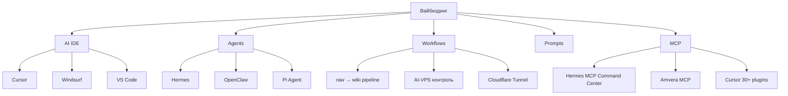

# overview

Верхнеуровневая сводка базы знаний. Здесь — карта ключевых идей, текущий фокус и связи между основными темами.

## Цель базы

Это хранилище знаний по **вайбкодингу и смежным темам**: AI IDE, Claude Code, агенты, MCP, workflow, промпт-инжиниринг, выбор ниш, монетизация AI-продуктов, кейсы и анти-паттерны. База организована по принципу **LLM Wiki** (модель Карпати): сырьё попадает в `raw/`, после обработки — структурированное знание в `wiki/`.

## Операционная схема

База управляется через три операции:

- **ingest** — чтение источника из `raw/`, извлечение знаний, создание source-summary и обновление concept/entity-страниц.
- **query** — ответы на вопросы пользователя по накопленному знанию; durable-ответы сохраняются в `wiki/queries/`.
- **lint** — периодическая проверка базы: orphan-страницы, противоречия, недостающие связи, устаревшие утверждения.

Полная операционная схема — в [[wiki/sources/2026-09-19-project-claude-md|CLAUDE.md проекта]].

## Текущие крупные темы

### 1. AI-агенты

Агенты — ключевая тема. Главный герой сейчас — [[wiki/entities/hermes-agent|Hermes Agent]]: агент с памятью, навыками, MCP Command Center, мульти-интерфейсом (Telegram/CLI/Web/Discord/Slack и 20+ других), Bot Mode для командной работы агентов. В v0.21 (Pantheon Release) появились cron с памятью, `hermes peer` для bot-to-bot DM, 6 новых провайдеров моделей. Стек типичного развёртывания: [[wiki/entities/amvera-cloud|Amvera Cloud]] + [[wiki/entities/openrouter|OpenRouter]] + [[wiki/concepts/agent-memory-skills|память/навыки/самообучение]].

Альтернативы:

- [[wiki/entities/openclaw|OpenClaw]] — open-source Foundation, 388k+ stars, без hosted-сервиса; пользователь ранее мигрировал с него на Hermes.
- [[wiki/entities/windsurf|Windsurf / Devin Desktop]] — agentic VS Code fork с Cascade, Flow awareness, Memories. История собственности драматична (OpenAI → Google → Cognition).
- [[wiki/entities/pi-agent|Pi Agent]] — coding agent SDK/CLI, альтернатива «в терминале».

См. также:

- [[wiki/concepts/mcp-basics|MCP]] — стандарт подключения инструментов к агенту.
- [[wiki/concepts/llm-wiki-template|LLM Wiki шаблон]] — методология, на которой построена сама база.

### 2. AI IDE

Три главных конкурента 2026:

- [[wiki/entities/cursor|Cursor]] — AI-first IDE, $29,3 млрд оценка, Composer 2 + Background Agents, MCP-экосистема из 30+ плагинов.
- [[wiki/entities/windsurf|Windsurf]] — plan-then-execute архитектура (Cascade), Memories, сильнейший enterprise-стек (SOC 2, FedRAMP High, self-host).
- [[wiki/entities/vscode|VS Code]] — базовая среда, поверх которой построены Cursor и Windsurf; сама поддерживает AI через расширения, Workspace Trust, Remote Development, Dev Containers.

Базовые показатели:

- SWE-bench Verified: Claude Code (Opus 4.6) 80.8%, Cursor (Claude Sonnet 4.6) ~72%, GitHub Copilot 56%, Cursor (Auto mode) ~52%.
- Цена Pro: Cursor $20, Windsurf $20, GitHub Copilot $10.
- Все три — VS Code-совместимые (форк или совместимость).

### 3. Workflows

В материалах уже есть рабочий процесс «AI-агент управляет группой VPS» ([[wiki/sources/2026-09-18-ai-vps-control]]), с интеграцией Cloudflare Tunnel для безопасного доступа. Также есть [[wiki/concepts/vault-raw-wiki-pipeline|pipeline raw→wiki]] и [[wiki/concepts/prompt-pattern-json-out|строгий JSON-выход]] для продакшн-агентов.

### 4. Инфраструктура

- [[wiki/entities/docker|Docker]] — основной способ упаковки агентов и сервисов.
- [[wiki/entities/amvera-cloud|Amvera Cloud]] — российский PaaS от 170 ₽/мес, регионы Москва + Варшава, бесплатное проксирование OpenAI/Claude/Gemini.
- [[wiki/entities/cloudflare-tunnel|Cloudflare Tunnel]] — безопасный доступ к self-hosted дашбордам без домена.
- [[wiki/entities/openrouter|OpenRouter]] — мульти-LLM-провайдер, 500+ моделей, free-tier до 1 000 req/day после $10 депозита.
- [[wiki/entities/hshp-host|hshp.host]] — VPS-провайдер для VPS-2 (pi-coding-agent). Биллинг BILLmanager, локации RU/DE/FI/FR, KVM. Тариф DE-E2 (2 vCPU / 4 ГБ / 60 ГБ / 500 Мбит/с, ~600 ₽/мес) уже куплен. Id 1950834.
- [[wiki/entities/orca-ade|Orca ADE]] — опциональный GUI-фронтенд для всего dual-agent-stack. Worktree-first, BYOA (поддерживает Pi и Hermes Agent), Y Combinator, MIT, бесплатный, кросс-платформенный. См. [[wiki/concepts/dual-agent-stack]].
- [[wiki/entities/netbird|NetBird]] — mesh-VPN на WireGuard (BSD-3, self-hosted). Альтернатива Cloudflare Tunnel для peer-to-peer связи между VPS. Поддерживает Linux/Windows/macOS/mobile/Docker/routers. См. [[wiki/concepts/dual-agent-stack]].

### 4.5. Тестовая инфраструктура

Дополнительно к прод-стеку (VPS-1 + VPS-2) планируется **3 отдельных test-VPS** для staging и docker-compose-стендов. См. [[wiki/concepts/docker-test-stack]]:

- **VPS-test-1** (Stage-pi) — staging копия pi-coding-agent (2 vCPU / 4 ГБ / 40 ГБ).
- **VPS-test-2** (Stage-Hermes) — staging копия Hermes (1 vCPU / 2 ГБ / 20 ГБ).
- **VPS-test-3** (Stage-Infra) — docker-compose-стенды (Node-RED, Mosquitto, Traefik, ollama) + бенчмарки моделей (2 vCPU / 4 ГБ / 60 ГБ).

**Полная изоляция от прода:** отдельные SSH-ключи, отдельная docker-сеть `dual-agent-test`, отдельная ветка vault-репо или отдельный `obsidian-vault-test`, отдельные API-ключи.

### 5. Шортлист моделей (выбор под задачу)

См. [[wiki/comparisons/2026-09-25-model-shortlist]] — там вся сводка с ценами и рекомендациями. Кратко:

- **Дефолт:** `xiaomi/mimo-v2.6-pro` (через xiaomi-token-plan-cn, $0) или `openai/gpt-6-luna` ($0.5/M out).
- **Flash (рутина, длинные логи):** `z-ai/glm-5.3-flash` или `deepseek/deepseek-v4-flash`.
- **Coding-эксперт:** `anthropic/claude-fable-5.1`, иначе `moonshotai/kimi-k2.7-code`.
- **Flagship (только для сложных задач):** `anthropic/claude-opus-5.5` или `openai/gpt-6-astra`.
- **Бесплатно без бюджета:** `wormsoft/minimax-m3` (текущая), `wormsoft/mine/onlycode`, `wormsoft/mine/vision`, `google/gemma-4-31b-it`.

### 6. Промпт-инжиниринг

- [[wiki/concepts/prompt-pattern-json-out|Prompt pattern: строгий JSON-выход]] — базовый паттерн для продакшн-агентов.

## Текущие пробелы

- **Мало материала по Claude Code как CLI-агенту** — упоминается в обзорах (80.8% на SWE-bench), но нет полноценного источника. Нужны собственные кейсы.
- **Нет кейсов по монетизации AI-продуктов и выбору ниш** — это подпапки `SaaS с ИИ`, `Ниши`, `Монетизация` в [[wiki/index]], но источников пока нет.
- **Нет приличного материала по анти-паттернам.**
- **Сырьё по Docker/SQL/S3/OpenAPI/SSH лежит в `raw/`** как архив, в wiki не интегрировано.

## Что стоит сделать следующим

1. Создать тематические подпапки под «недозакрытые» темы (Claude Code, SaaS с ИИ, Ниши, Монетизация, Ошибки и анти-паттерны, Глоссарий) — когда появятся первые источники.
2. Запросить у пользователя локальный экспорт Notion-материалов (внешние ссылки сейчас недоступны).
3. Сделать полноценный lint-проход после того, как накопится ≥ 30 wiki-страниц.
4. Собрать собственные кейсы использования Cursor/Windsurf/Hermes.

## Связи верхнего уровня

